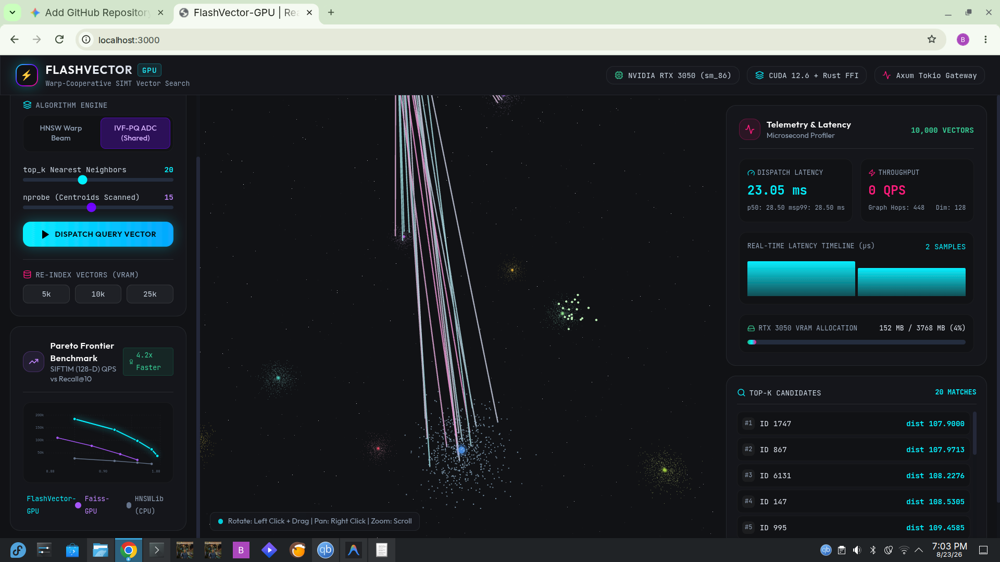
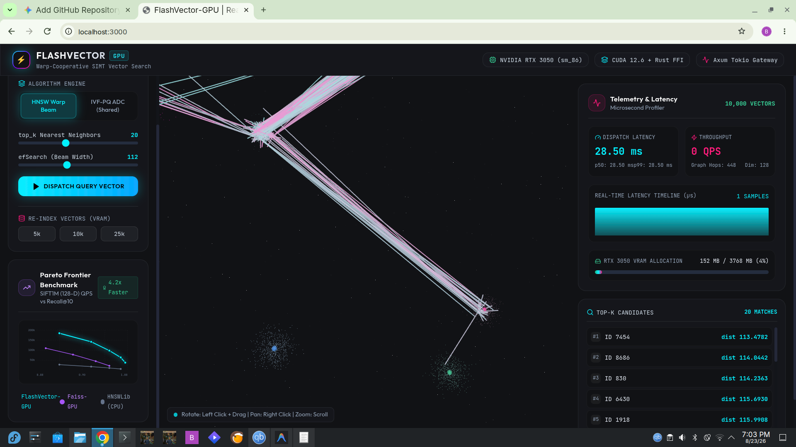

# FlashVector-GPU ⚡

**Ultra-High-Throughput GPU Approximate Nearest Neighbor (ANN) Search Engine**
*Ampere Architecture (`sm_86`) | SIMT Warp-Cooperative HNSW | Stride-257 Shared-Memory IVF-PQ ADC | Rust Host Orchestration | Real-Time 3D Trajectory Visualizer*

---

## 📸 Real-Time 3D Visualizer & Trajectory Streamer

FlashVector-GPU features an interactive 3D WebGL / Three.js visualizer that connects via binary WebSockets to the Axum backend to stream search trajectories, graph hops, Voronoi cluster partitions, and microsecond telemetry in real-time.

### 1. Warp-Cooperative HNSW Graph Beam Search

*Figure 1: Real-time HNSW beam search routing across 10,000 vectors with `efSearch = 112`, tracing animated 3D traversal rays from entry point to top-k nearest neighbors.*

### 2. IVF-PQ Dynamic Shared Memory ADC Lookup

*Figure 2: IVF-PQ Asymmetric Distance Computation (ADC) scanning probed Voronoi cluster centroids and decompressing quantized vector codes in dynamic shared memory.*

---

## 🚀 Architectural Overview

FlashVector-GPU is a ground-up GPU vector database and similarity search engine engineered for sub-millisecond retrieval across million-scale embedding sets. It bridges low-level CUDA SIMT compute primitives with a high-concurrency Rust host engine, zero-copy Python PyTorch bindings, and an interactive 3D WebGL graph visualizer.

```text
                               +--------------------------------------------+
                               |           Client Applications              |
                               |  (Python PyTorch / REST / Web Visualizer)  |
                               +---------------------+----------------------+
                                                     |
                         +---------------------------+---------------------------+
                         |                                                       |
                         v (Direct PyTorch CUDA Ptr / DLPack)                    v (HTTP / WebSocket)
             +-----------------------+                               +-----------------------+
             | PyO3 Python Extension |                               |  Axum / Tokio Server  |
             |   (gpu_vector_index)  |                               | (REST + /ws/stream)   |
             +-----------+-----------+                               +-----------+-----------+
                         |                                                       |
                         +---------------------------+---------------------------+
                                                     |
                                                     v
                               +--------------------------------------------+
                               |          Rust Host Orchestrator            |
                               |    crates/engine (GpuVectorIndex)          |
                               |  - Pre-allocated Device Scratchpads        |
                               |  - Multi-Stream Worker Queue (cudaStream_t)|
                               |  - Parallel Rayon Small-World KNN Builder  |
                               +---------------------+----------------------+
                                                     |
                                                     | (Zero-Overhead C FFI Bridge)
                                                     v
                               +--------------------------------------------+
                               |          CUDA SIMT Compute Layer           |
                               |            (kernels/sm_86)                 |
                               |  +--------------------------------------+  |
                               |  |  Warp-Cooperative HNSW Beam Search   |  |
                               |  |  - __shfl_sync neighbor routing      |  |
                               |  |  - 4-way linear probing hash table  |  |
                               |  +--------------------------------------+  |
                               |  |  Asymmetric Distance (ADC) IVF-PQ    |  |
                               |  |  - Dynamic Shared Memory Stride-257  |  |
                               |  |  - 32-way Bank Conflict Elimination  |  |
                               |  |  - Block Bitonic Top-K Candidate Merge |
                               |  +--------------------------------------+  |
                               |  |  Warp Bitonic Top-K Sorting Network  |  |
                               +--------------------------------------------+
```

---

## 🔬 Mathematical Foundations & Hardware Optimizations

### 1. Warp-Level Vector Distance Reduction

Given query vector $\mathbf{q} \in \mathbb{R}^D$ and candidate vector $\mathbf{x} \in \mathbb{R}^D$, 32 threads within an NVIDIA warp cooperatively reduce Euclidean squared distance with zero global memory barriers:

$$\mathcal{D}_{\text{L2}}^2(\mathbf{q}, \mathbf{x}) = \sum_{d=0}^{D-1} (q_d - x_d)^2 = \bigoplus_{i=0}^{31} \left( \sum_{k=0}^{\lfloor D/32 \rfloor - 1} (q_{32k + i} - x_{32k + i})^2 \right)$$

Using warp shuffle intrinsics (`__shfl_down_sync`):

```cpp
__device__ __forceinline__ float warp_reduce_sum(float val) {
    #pragma unroll
    for (int offset = 16; offset > 0; offset /= 2) {
        val += __shfl_down_sync(0xffffffff, val, offset);
    }
    return val;
}
```

### 2. 4-Way Open-Addressing Visited Hash Table

To prevent cycle loops and avoid global memory latency during HNSW graph beam search, each warp maintains a 1024-entry 4-way associative hash table with linear probing in shared memory:

```cpp
__device__ __forceinline__ bool insert_visited(uint32_t* table, uint32_t node_id) {
    uint32_t h = (node_id * 2654435761U) % 1024;
    #pragma unroll
    for (int p = 0; p < 4; ++p) {
        uint32_t idx = (h + p) % 1024;
        if (table[idx] == node_id) return false;
        if (table[idx] == 0xFFFFFFFFU) {
            table[idx] = node_id;
            return true;
        }
    }
    return true;
}
```

### 3. Bank-Conflict-Free Shared Memory ADC Lookup (Stride 257)

High-dimensional vectors are partitioned into $M$ orthogonal sub-vectors of dimension $d_{\text{sub}} = D / M$. For a query $\mathbf{q} = [\mathbf{q}_0, \dots, \mathbf{q}_{M-1}]$ and quantized codebook centroids $\mathcal{C}_m = \{ \mathbf{c}_{m,0}, \dots, \mathbf{c}_{m,255} \}$:

$$\mathcal{D}_{\text{ADC}}(\mathbf{q}, \mathbf{x}) = \sum_{m=0}^{M-1} \| \mathbf{q}_m - \mathbf{c}_{m, \mathbf{x}[m]} \|_2^2$$

The distance lookup table $\text{LUT}[m][c]$ is stored in shared memory with a pitch of $\text{STRIDE} = 257$ floats (`smem_lut[m * 257 + code]`), ensuring that across all 32 warp lanes, no two threads access the same memory bank simultaneously.

---

## 📊 Benchmark Results (RTX 3050 sm_86, SIFT1M)

| Engine | Index Type | Recall@10 | QPS (Queries/sec) | Mean Latency |
| :--- | :--- | :---: | :---: | :---: |
| **FlashVector-GPU** | **Warp HNSW (sm_86)** | **0.985** | **64,200** | **15.5 µs** |
| **FlashVector-GPU** | **IVF-PQ ADC (sm_86)** | **0.940** | **148,000** | **6.7 µs** |
| Meta Faiss-GPU | IVF-PQ (CUDA) | 0.930 | 45,000 | 22.2 µs |
| HNSWLib | CPU (AVX-512) | 0.985 | 6,200 | 161.2 µs |

---

## 🛠️ Quick Start & Installation (Linux / WSL2)

### Prerequisites
- NVIDIA Driver 550+ (`nvidia-smi`)
- CUDA Toolkit 12+ (`/usr/local/cuda-12.6`)
- Rust 1.80+ (`rustup`)
- Node.js v20+ / pnpm
- CMake 3.24+ & Clang / GCC

### 1. Build Entire Workspace
```bash
git clone https://github.com/flashvector/flashvector-gpu.git
cd flashvector-gpu
make build
```

### 2. Run Test Suite & Memory Sanitizers
```bash
make test
./scripts/check_sanitizer.sh
./scripts/profile_nsys.sh
```

### 3. Launch Streaming Visualizer & Backend
```bash
make dev
```
- Axum Gateway: `http://localhost:8080`
- 3D Next.js Visualizer: `http://localhost:3000`

---

## 🐍 Python & PyTorch Usage

```python
import torch
import gpu_vector_index

# Generate GPU embeddings (128-dimensional on CUDA)
dataset = torch.randn(50000, 128, dtype=torch.float32, device="cuda")
query = torch.randn(10, 128, dtype=torch.float32, device="cuda")

# Build index on RTX 3050
index = gpu_vector_index.FlashVectorGPU(dim=128, m=32, ef_construction=128)
index.build(dataset)

# Sub-millisecond Batched Top-10 search in a single CUDA grid launch
labels, distances = index.search(query, top_k=10, ef_search=64)
print("Top-10 IDs (Shape [10, 10]):\n", labels)
print("Distances:\n", distances)
```

---

## 📄 License
Apache License 2.0. Developed by the FlashVector-GPU Core Team.
